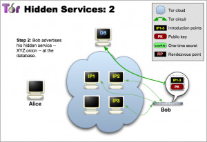
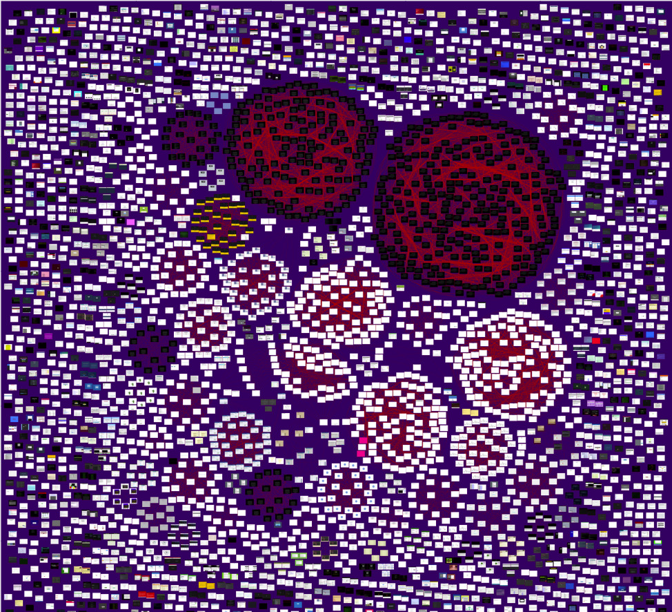
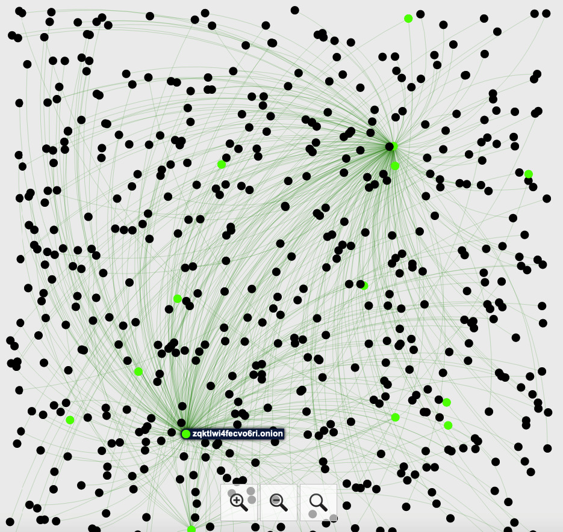
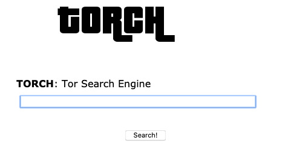
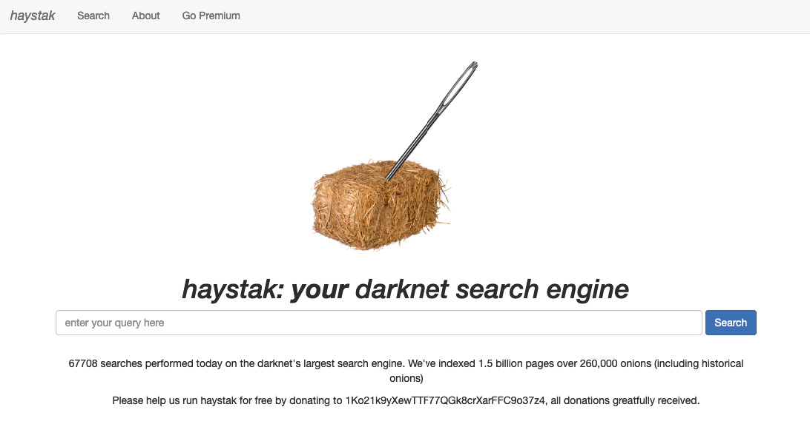
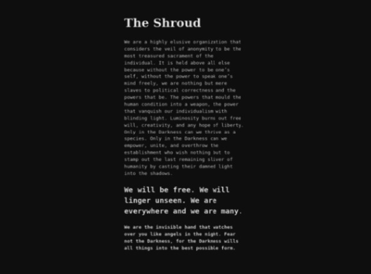
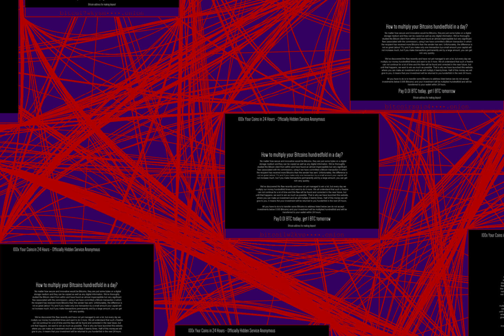
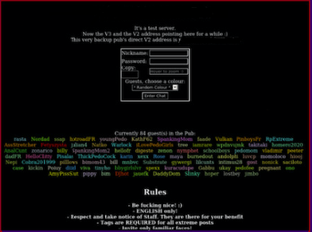

# hidden services

- **tags**: #torify #hdt #tor #HSDir #darkweb
- **sources**:
	- https://svn-archive.torproject.org/svn/projects/presentations/2013-11-t3am-tor-ecosystem.pdf_
---
## background
For a user to access a hidden service, a hidden service descriptor (hdt) must be retrieved, which contains lists of intro nodes and a descriptor ID.

The hidden service publishes updated descriptors to a set of responsible HSDir's every hour.

Once the client has a copy of the hidden service descriptor they can attempt to connect to one the introduction point and create a complete 7 hop circuit to the hidden service.

  - Tor hidden service directories (HSDir’s) receive a subset of hidden service look-ups from users, allowing them to map relative popularity/usage of hidden service.
  - An adversary with minimal resources can carry out complete DoS attacks of Tor hidden services by running malicious Tor hidden service directories and positioning them in a particular part of the router list.
  - Many look-ups for Tor hidden services go to the incorrect hidden service directories which negatively affects the initial time to access the site.
  - Looking at well established methods of publishing locations of hidden services, whether or not they are legitimate.
  
    

## finding hidden services

### hyperiongrey

_this is a periodically updated darkweb map of hidden services, 
note the clusters of red/black indications of campaigns for spam/malware/fraud._

### ahmia

_you can see the highlighted Hidden Service Wiki and its relationship to the other nodes_

## disclaimer
There is some pretty vile things lurking in the darkness here. There are also many who blatantly operate out in the open. _**Do not seek out these places!**_

 _down the [[rabbithole]] we go..._

Before you find the most suspicious fucking thing to dive into, some caveats:
  
  1. the full .onion url is wildcarded for obvious reasons
  2. ensure you a **strict** setup for how you navigate the 'fog', like:
     1. ensuring you don't use windows, fuck the telemetry and how they abuse user-data
     2. no javascript, flash or autoplaying media, use **NoScript**
  3. do not bring any artifacts back with you, whether you are LEA or not
  4. be responsible, and report/disclose anything you deem dangerous (_in the loosest terms possible_)

### searching

- not Evil
- torch

    

- haystak
  
    

### weird stuff
Taking a few screenshots of some oddities, aside from all the VILE animal/rape/torture/cp shit...

_not sure I was looking for Hell..._

_The Shroud? hmm, another copycat Cicada 3301?_

_btc scams or possible c2-payment nodes_

_it's ~~OPEN~~ season on hunting ~~STEGO~~sauruses into extinction_  :eyes:

# references:
- https://www.hyperiongray.com/dark-web-map [[map]]
- https://ahmia.fi/stats/link_graph [[graph]]
- search engines: [[search-engines]]
   - not Evil
   - haystak
   - torch
