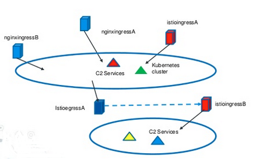
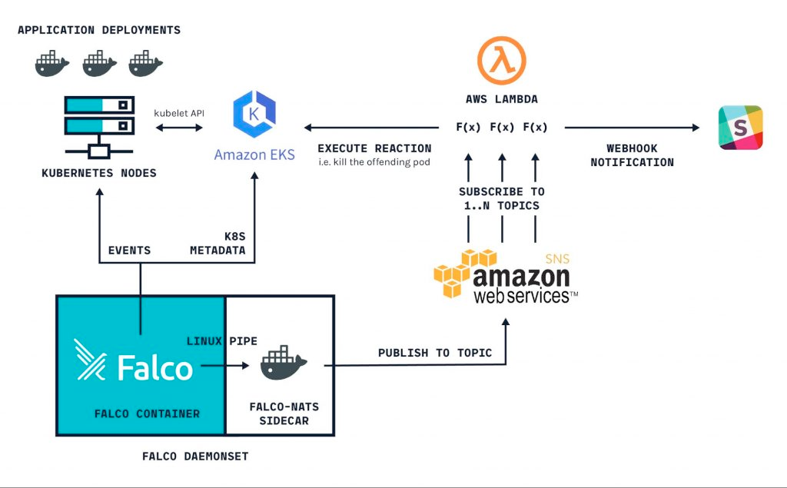

# c2 operations kubernetes

- tags: #c2 #kubernetes #redteam #attacks #defense
- source: `none`
---

- [[c2]] frameworks
	- merlin/https2
	- silenttrinity
	- cobalt strike

- [[containers]]

- [[adversaries]] strategies
	- Actors may leverage [[serverless]] resources like [[lambda]] functions in AWS.
		- Imagine an adversary or [[warden]] "poisoning the well" and feeding manipulated alerts or severity warnings to chatops.
			- Operators may make "break glass" changes or act on these alerts by facilitating some action (oAuth sign-in requests), allowing an adversary to leverage changes for some purpose.
		- An actor may establish a TCP [[reverse shell]] for the purpose of introspecting container runtimes in different clouds.
	- [[cryptojacking malware]]
		- Adversaries use public container registries such as Docker Hub and Quay to store and deliver malicious container images. 
			- As Docker Hub is the default registry trusted by most Docker hosts
		- These types of malware are pulled and run as containers directly on the compromised hosts. They typically just steal the CPU, memory, or networking resources.
		- Deploy benign container images and download malicious payloads at runtime to subvert scanning/validating legitimate hosted images.
	- Adversaries use various domains/services to distribute their malicious payloads
	
		| Website | Information |
		| --- | --- |
		| bigbotpein[.]cf | Users can upload and download files anonymously
		| mediafire[.]com | Users can upload and download files anonymously
		| transfer[.]sh | Users can upload and download files anonymously
		| ix[.]io | Users can use REST API to paste, view, and delete plain text files
		| gyazo[.]nl | Users can upload images or videos and receive a download link.
		| onion[.]ly | A Tor web proxy that allow users to access Tor services through regular browsers
		| onion[.]ws | A Tor web proxy that allow users to access Tor services through regular browsers
		| tor2web[.]su | A Tor web proxy that allow users to access Tor services through regular browsers
		| ngrok[.]io | A service that exposes a local web server to the internet. C2 can be hidden behind the service

- [[mitigation]] low-level strategies
	- Always enforce mutual authentication when configuring TLS on Docker daemon socket
	- Use Unix socket to communicate with Docker daemon locally or use SSH to connect to a remote Docker daemon
	- Only let an “allow list” of client IPs to access the Docker server
	- Enable Content Trust in Docker so that only signed and verified images can be pulled
	- Scan every container image for vulnerabilities and malicious code.
	- Deploy run time protection tools to monitor the running containers.

- [[kubernetes-services]] for c2 operations and architectures
	- EKS on Fargate
	- Service Mesh with Istio
		- consider Calico
		- consider Gloo
	- Service Mesh visualization with Kiali